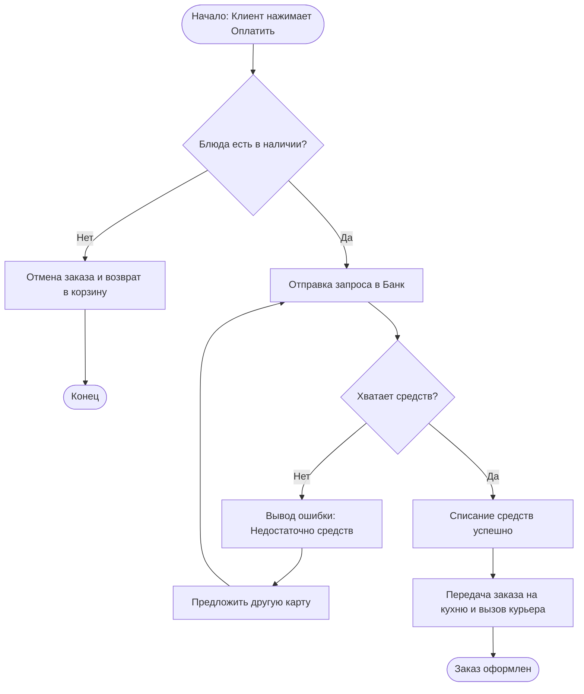

```mermaid
flowchart TD
    Start([Начало: Клиент нажимает Оплатить]) --> CheckCart{Блюда есть в наличии?}
    
    CheckCart -- Нет --> CancelOrder[Отмена заказа и возврат в корзину]
    CancelOrder --> EndOrder([Конец])
    
    CheckCart -- Да --> SendPayment[Отправка запроса в Банк]
    SendPayment --> CheckMoney{Хватает средств?}
    
    CheckMoney -- Нет --> ErrorMsg[Вывод ошибки: Недостаточно средств]
    ErrorMsg --> RetryPayment[Предложить другую карту]
    RetryPayment --> SendPayment
    
    CheckMoney -- Да --> SuccessPayment[Списание средств успешно]
    SuccessPayment --> CookAndDeliver[Передача заказа на кухню и вызов курьера]
    CookAndDeliver --> SuccessEnd([Заказ оформлен])
```