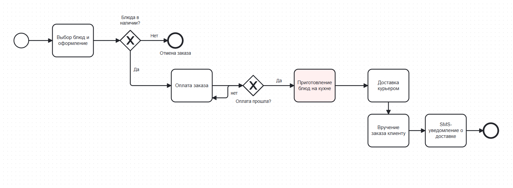
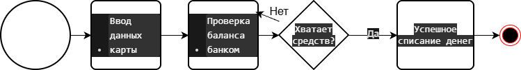

# Отчет по лабораторной работе №1
**Тема:** Моделирование процессов с использованием Git и визуальных нотаций  
**Студент:** Тачгулиев Перхат  
**Группа:** 2 курс, факультет математики и информатики (ГрГУ)

---

## 1. Описание выбранного процесса
В качестве темы был выбран бизнес-процесс **«Онлайн-заказ еды в ресторане с доставкой»**.
Процесс включает в себя выбор блюд клиентом, проверку наличия позиций кухней ресторана, проведение безналичной оплаты через банковский шлюз, приготовление блюд и вызов курьера, доставку и вручение заказа с отправкой итогового SMS-уведомления.

---

## 2. Разработанные диаграммы

### 2.1. BPMN-диаграмма (Основной процесс)
Файлы в репозитории: `diagrams/process.bpmn` и `diagrams/process-bpmn.png`  

### 2.2. UML Activity Diagram (Детализация шага оплаты)
Файлы в репозитории: `diagrams/activity.drawio` и `diagrams/activity-uml.png`  

### 2.3. Sequence Diagram (Взаимодействие участников)
Файл в репозитории: `docs/sequence.md`

### 2.4. Flowchart (Алгоритм проверки оплаты)
Файл в репозитории: `docs/flowchart.md`

---

## 3. Сравнение версионирования (git diff)
При добавлении нового блока («SMS-уведомление о доставке») в схему BPMN была наглядно продемонстрирована разница между форматами:
* **Текстовый формат (.bpmn / XML):** Git отследил точные изменения построчно. Зеленым цветом отобразились добавленные теги задачи `<bpmn:task>` и новые связи `<bpmn:sequenceFlow>`, а красным — удаленные старые связи.
* **Бинарный формат (.png):** Git не может показать изменения внутри картинки и выдает лишь сообщение `Binary files differ`, что делает отслеживание правок невозможным без ручного визуального сравнения.

---

## 4. Выводы
В ходе выполнения лабораторной работы я освоил базовые команды системы контроля версий Git (clone, add, commit, push, diff), настроил глобальные параметры пользователя с университетской почтой и опубликовал публичный репозиторий на GitHub. 

Также я научился моделировать бизнес-процессы с помощью современных визуальных нотаций: BPMN, UML Activity, а также текстовых диаграмм Mermaid (Sequence и Flowchart). На практике убедился в преимуществе хранения диаграмм в текстовом виде (XML/текст), так как это позволяет полноценно отслеживать историю изменений через Git.