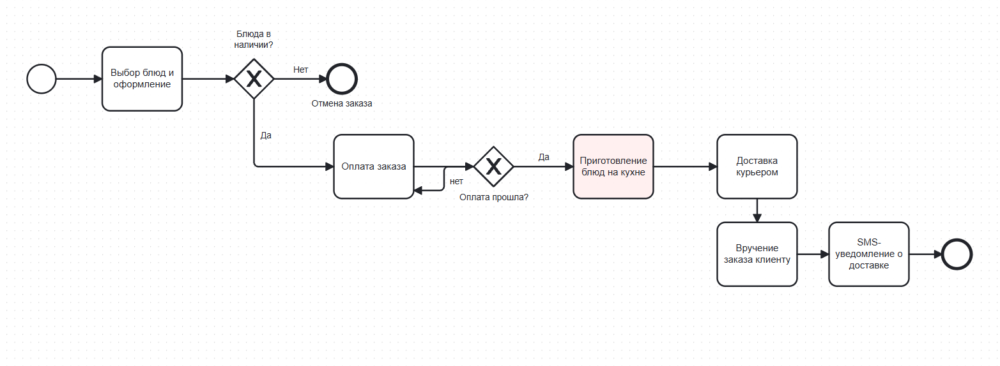

# Отчет по лабораторной работе №1
**Тема:** Моделирование процессов с использованием Git и визуальных нотаций  
**Студент:** Тачгулиев Перхат  
**Группа:** 2 курс, факультет математики и информатики (ГрГУ)

---

## 1. Описание выбранного процесса
В качестве темы был выбран бизнес-процесс **«Онлайн-заказ еды в ресторане с доставкой»**.
Процесс включает в себя выбор блюд клиентом, проверку наличия позиций кухней ресторана, проведение безналичной оплаты через банковский шлюз, приготовление блюд и вызов курьера, доставку и вручение заказа с отправкой итогового SMS-уведомления.

---

## 2. Разработанные диаграммы

### 2.1. BPMN-диаграмма (Основной процесс)
Файлы в репозитории: `diagrams/process.bpmn` и `diagrams/process-bpmn.png`  

### 2.2. UML Activity Diagram (Детализация шага оплаты)
Файлы в репозитории: `diagrams/activity.drawio` и `diagrams/activity-uml.png`  

### 2.3. Sequence Diagram (Взаимодействие участников)
Файл в репозитории: `docs/sequence.md`

### 2.4. Flowchart (Алгоритм проверки оплаты)
Файл в репозитории: `docs/flowchart.md`

---

## 3. Сравнение версионирования (git diff)
Когда я добавил новый шаг («SMS-уведомление») в схему BPMN, я проверил разницу файлов через консоль:
* В файле **.bpmn** Git сразу показал зеленым цветом добавленный кусок XML-кода с названием блока и новые стрелки. То есть текстовые схемы версионируются идеально — видно каждую строчку.
* Для файла **.png** Git просто написал `Binary files differ`. Внутри картинки Git изменения отследить не может, он видит её целиком как один большой файл.

---

## 4. Выводы
В этой лабораторной работе я впервые на практике поработал с Git через консоль: научился клонировать репозиторий, делать коммиты и отправлять их на GitHub. 

Также я разобрался, как один и тот же процесс заказа еды можно показать по-разному: через бизнес-схему BPMN, диаграмму действий UML и текстовые диаграммы Mermaid. Главный вывод работы — хранить схемы и код в текстовых форматах намного удобнее, чем в картинках, потому что тогда Git позволяет отслеживать каждую правку в истории.